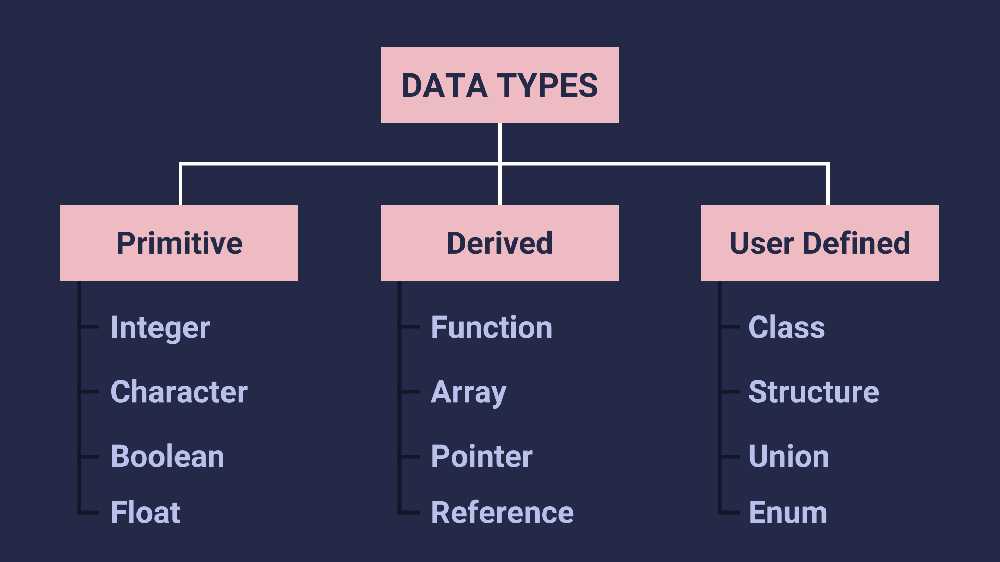

## Overview

<div className="text--center">


</div>

`C++` is a general-purpose programming language created by Bjarne Stroustrup as an extension of the C programming language, or "C with Classes".

C++ is a complied language. C++ source files has the `.cpp` extension.
:::info

<center>


</center>

- [Source: niu.edu](http://faculty.cs.niu.edu/~mcmahon/CS241/Notes/build.html)

:::  
C++ is a case-sensitive language.

- Lets write simple c++ program which will print `Hello World` on the screen.

```cpp title="hello_world.cpp"
#include <iostream>

int main() {
  std::cout << "Hello World" << std::endl;
  return 0;
}
```

In the above code

- `#include` is a preprocessor directive used to include the header files.
- `iostream` is a header file for taking input or printing output.
- `int` is type of data returned by function.
- `main` is the function where execution of code begins in any c++ program.
- `cout` is used for displaying output in quotation marks.
- `;` marks the end of the statement.
- `return 0` Exit status of the function.
- `{}` define the start and end of the code block (main function here).

:::info
In `C++` execution of code begins from `main` function.
:::

## Comments

- Comments are lines that exist in computer programs that are ignored by compilers and interpreters.
- Including comments in programs makes code more readable for users as it provides some information or explanation about what each part of a program is doing.

- There are two types of comments in C++
  - Single-line comments `//` anything after these `//` is comment
  - Multi-line comments `/* */` anything in-between `/* */` those asterisks is comment

## Variables

Variable is an arbitrary name given to the memory location which is used to store some data (value) in computer program. The value stored in a variable can be changed.Variables are given unique names to differentiate between different memory locations.

Creating a variable is known as **variable declaration** and assigning some value to the variable is known as **initialization**.

### Rules for declaring a variable name

- Variable hold a single type of data hence we've to define the type of variable.
- Variable name must begin with a letter of alphabet or underscore.
- Variable name should not contain space or special characters.
- Variable name cannot be started with number but variable name can have number in between or end of the name.
- C++ keywords cannot be used as variable names.

:::info
Variable names are case-sensitive.
:::

```cpp
// lets declare a variable named a of type integer
int a;

// initialize the variable a with value 10
a = 10;

// declare and initialize a variable in one step
int b = 20;
```

## Data Types

There are three types of data types.



### Primitive Data types

These are the built-in data types. These are the basic data types which are used to represent the single value. Integer, Character, Float, Boolean.

#### Type Modifiers

Type Modifiers modify the size occupied by the given data type in memory or it can be used to increase the range by excluding negative values. They are `long` (8 bytes), `short` (2 bytes), `signed` (4 bytes), `unsigned` (4 bytes).

:::tip
Range of any N-bit signed integers was from $-(2^{N-1})$ to $+(2^{N-1}-1)$

1 Byte = 8 bits
:::

| Data Type              | Size (Bytes) |                    Range                     |
| ---------------------- | :----------: | :------------------------------------------: |
| char                   |      1       |                 -128 to +127                 |
| short char             |      1       |                 -128 to +127                 |
| unsigned char          |      1       |                   0 to 255                   |
| short int              |      2       |               -32768 to +32767               |
| unsigned short int     |      2       |                  0 to 65535                  |
| int                    |      4       |          -2147483648 to +2147483647          |
| unsigned int           |      4       |               0 to 4294967295                |
| long int               |      8       | -9223372036854775808 to +9223372036854775807 |
| unsigned long int      |      8       |          0 to 18446744073709551615           |
| long long int          |      8       | -9223372036854775808 to +9223372036854775807 |
| unsigned long long int |      8       |          0 to 18446744073709551615           |
| float                  |      4       |          1.17549e-38 to 3.40282e+38          |
| float(negative)        |      4       |         -1.17549e-38 to -3.40282e+38         |
| double                 |      8       |         2.22507e-308 to 1.79769e+308         |
| double(negative)       |      8       |        -2.22507e-308 to -1.79769e+308        |

:::danger
Above values may vary from compiler to compiler. In the above example, we have considered GCC 32 bit.

For More Information [Refer Here](https://en.cppreference.com/w/cpp/language/types)
:::

```cpp title="data_types.cpp"
// print the sizes of the primitive data types and along with type modifiers
#include <iostream>

using namespace std;

int main()
{
  bool b;
  cout << "Size of boolean: " << sizeof(b) << endl;

  char c;
  cout << "Size of character: " << sizeof(c) << endl;

  int i;
  cout << "Size of int: " << sizeof(i) << endl;

  long int li;
  cout << "Size of long int: " << sizeof(li) << endl;

  float f;
  cout << "Size of float: " << sizeof(f) << endl;

  double d;
  cout << "Size of double: " << sizeof(d) << endl;

  long double ld;
  cout << "Size of long double: " << sizeof(ld) << endl;
}
```

```bash
# output of the above program
$ ./data_types
Size of boolean: 1
Size of character: 1
Size of int: 4
Size of long int: 8
Size of float: 4
Size of double: 8
Size of long double: 16
```

### Derived Data types

These are derived from Primitive(built-in) data types. Like `Array`, `Function`, `Pointer` and `Reference`.

### User-Defined Data types

These are defined by users. Like, defining a class in C++ or a structure. `Class`, `Structure`, `Union`, `Enum`

## Basic Input Output

`iostream` header file is used for taking input and printing output.

`cout` is used to display on screen.
`<<` is an insertion operator used along with `cout`.
`cin` is used to take input from the user.
`>>` is an extraction operator used along with `cin`.

```cpp title="basic_io.cpp"
#include <iostream>

using namespace std;

int main() {
  cout << "Hello World\n";
  return 0;
}
```

```bash title="output"
$ ./basic_io
Hello World
```

```cpp title="input_sum.cpp"
// Take two numbers from user and print sum of the given numbers
#include <iostream>

using namespace std;

int main() {
  int a;
  cout << "Enter a number: ";
  cin >> a;

  int b;
  cout << "Enter another number: ";
  cin >> b;

  int total = a + b;
  cout << "Sum of given numbers " << a << " and " << b << " is " << total << endl;

  return 0;
}
```

```bash title="output"
$ ./input_sum
Enter a number: 5
Enter another number: 8
Sum of given numbers 5 and 8 is 13
```

## Operators

Operators are nothing but symbols that tell the compiler to perform some specific operations on the given operands.

### Arithmetic Operators

Arithmetic operators perform some arithmetic operation on one or two operands.

**Unary Operators** are the operators that operate only on the one operand. `++` and `--` unary operators.

**Binary Operators** operate onn two operands. `+`, `-`, `*`, `/`, `%` are binary operators.

Lets assume `x = 7`, `y = 10`

| Operator | Operation                              | Example     |
| :------: | -------------------------------------- | ----------- |
|    +     | Addition of two operands               | x + y = 17  |
|    -     | Subtract second operand from first     | y - x = 3   |
|    \*    | Multiplies two operands                | x \* y = 70 |
|    /     | Divides first operand by second        | y / x = 1   |
|    %     | Gives remainder after integer division | y % x = 3   |
|    ++    | Increments value by one                | x++ = 8     |
|    --    | Decrements value by one                | x-- = 6     |

:::danger
**Pre** Increment/decrement (`++x`) changes the values instantly where as **Post** Increment/decrement (`x++`) changes the value only after completing the execution of current statement and before execution of next statement.
:::

Simple example on arithmetic operators

```cpp title="arithmetic_example.cpp"
#include <iostream>

using namespace std;

int main()
{
  int x = 10, y = 7;

  cout << "Addition of " << x << " and " << y << " is " << x + y << endl;
  cout << "Subtraction of " << x << " and " << y << " is " << x - y << endl;
  cout << "Multiplication of " << x << " and " << y << " is " << x * y << endl;
  cout << "Division of " << x << " and " << y << " is " << x / y << endl;
  cout << "Remainder of " << x << " and " << y << " is " << x % y << endl;

  // Observe these two lines
  cout << "Pre-Increment of " << x << " is " << ++x << endl;
  cout << "Post-Increment of " << y << " is " << y++ << endl;
}
```

```bash title="output"
$ ./arithmetic_example
Addition of 10 and 7 is 17
Subtraction of 10 and 7 is 3
Multiplication of 10 and 7 is 70
Division of 10 and 7 is 1
Remainder of 10 and 7 is 3
Pre-Increment of 10 is 11
Post-Increment of 7 is 7
```

### Relational Operators

Relational operators defines relation(comparision) between two operands and it returns boolean value.

Lets assume `x = 7`, `y = 10`

| Operator | Operation                                                                      | Example       |
| :------: | ------------------------------------------------------------------------------ | ------------- |
|    ==    | returns true if two operands are equal                                         | x==y is false |
|    !=    | returns true if two operands are not equal                                     | x!=y is true  |
|    >     | returns true if left operand operand is greater than right operand             | x==y is false |
|    <     | returns true if left operand operand is less than right operand                | x==y is false |
|    >=    | returns true if left operand operand is greater than or equal to right operand | x==y is false |
|    <=    | returns true if left operand operand is less than or equal to right operand    | x==y is false |

Example on Relational Operators

```cpp title="relational_example.cpp
#include <iostream>

using namespace std;

int main() {
  int age = 15;

  if (age >= 18) {
    cout << "You can vote" << endl;
  } else {
    cout << "Sorry, You're too young to vote" << endl;
  }

  return 0;
}

```

```bash title="output"
$ ./relational_example
Sorry, You're too young to vote
```

### Logical Operators

Logical operators are used to combine multiple expressions/conditions together or to negate the logical value.

Lets assume x = 0, y = 1

| Operator | Operation                                      | Example        |
| :------: | ---------------------------------------------- | -------------- |
|    &&    | Return true if both operands are non-zeros     | x && y = false |
|   \|\|   | Return true if any of the operands is non-zero | x && y = false |
|    !     | Negate the logical value of the operand        | !x = true      |

```cpp title="logical_example.cpp"
#include <iostream>

using namespace std;

int main() {
  bool rainy = false;

  if(!rainy) {
    cout << "No need of umbrella" << endl;
  } else {
    cout << "Take an umbrella with you" << endl;
  }
  return 0;
}
```

```bash title="output"
$ ./logical_example
No need of umbrella
```

### Bitwise operators

Bitwise operators perform bit by bit operations.

Lets assume A = 0100 (4), B = 0101 (5)

| Operator | Operation                                                                                                       | Example       |
| :------: | --------------------------------------------------------------------------------------------------------------- | ------------- |
| & (AND)  | The result will contain 1 only if two bits are 1                                                                | A&B = 0100    |
| \| (OR)  | The result will contain 1 if 1 exist in atleast one of the opearnds                                             | A \| B = 0101 |
| ^ (XOR)  | The result will contain one the two bits are different                                                          | A^B = 0001    |
|    ~     | Binary ones complement. Flips the bits                                                                          | ~A = 1011     |
|    <<    | Left shift operator. Left operand bits are moved left by the number of places specified by the right operand.   | A<< 1 = 1000  |
|    >>    | Right shift operator. Left operand bits are moved right by the number of places specified by the right operand. | A>> 1 = 0010  |

:::tip
If shift operators applied on N then `N<<a` will give a result $$N*2^a$$ and `N>>a` will give a result $N/2^a$
:::

### Assignment operators

| Operator | Operation                                                                              | Example                      |
| :------: | -------------------------------------------------------------------------------------- | ---------------------------- |
|    =     | Assigns value of right operand to left operand                                         | A=B will put value of B in A |
|    +=    | Adds right operand to the left operand and assigns the result to left operand.         | A+=B $\equiv$ A = A+B        |
|    -=    | Subtracts right operand from the left operand and assigns the result to left operand.  | A-=B $\equiv$ A=A-B          |
|   \*=    | Multiplies right operand with the left operand and assigns the result to left operand. | A*=B $\equiv$ A=A*B          |
|    /=    | Divides left operand with the right operand and assigns the result to left operand.    | A/=B $\equiv$ A=A/B          |

### Miscellaneous Operators

|     Operator      | Description                                                                                   | Example                                  |
| :---------------: | --------------------------------------------------------------------------------------------- | ---------------------------------------- |
|    `sizeof()`     | Returns the size of a variable                                                                | `sizeof(x)` will return 4 since x is int |
| condition ? x : y | Conditional operator. If condition is true, then returns value of `x` or else value of `y`    | `2==3? 5 : 8`                            |
|        `,`        | Comma Operator causes a sequence of operations to be performed                                |                                          |
|       Cast        | Cast Operator converts one data type to another                                               | `(int)3.14` would return `3`             |
|         &         | returns the address of a variable.                                                            |                                          |
|        \*         | pointer to a variable.                                                                        | \*x will pointer to variable x           |
|   `->` and `.`    | Member operators are used to reference individual members of classes, structures, and unions. |                                          |

### Precedence of Operators

| Category       |              Operator              | Associativity |
| -------------- | :--------------------------------: | ------------- |
| Postfix        |         () [] -> . ++ - -          | Left to right |
| Unary          |  + - ! ~ ++ - - (type)\* & sizeof  | Right to left |
| Multiplicative |               \* / %               | Left to right |
| Additive       |                + -                 | Left to right |
| Shift          |               << >>                | Left to right |
| Relational     |             < <= > >=              | Left to right |
| Equality       |               == !=                | Left to right |
| Bitwise AND    |                 &                  | Left to right |
| Bitwise XOR    |                 ^                  | Left to right |
| Bitwise OR     |                 \|                 | Left to right |
| Logical AND    |                 &&                 | Left to right |
| Logical OR     |                \|\|                | Left to right |
| Conditional    |                 ?:                 | Right to left |
| Assignment     | = += -= \*= /= %=>>= <<= &= ^= \|= | Right to left |
| Comma          |                 ,                  | Left to right |

:::info
Unary, Conditional and Assignment operators have **Right to Left** associativity
:::
