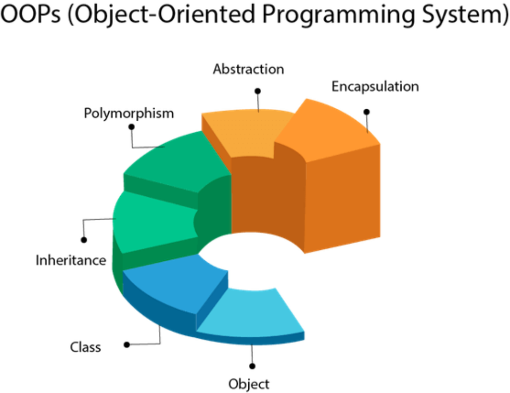

## Introduction

C++ is a combination of a procedural and an object-oriented language. Object-Oriented programming is a programming paradigm that relies on the concept of classes and objects. OOP is based on the notion that you should divide your program not into tasks, but into models of physical objects. While this seems abstract at first, it becomes clearer when you consider physical objects in terms of their classes, components, properties, and behaviors.



## Advantages of OOP

1. OOPs is closer to real world model.
2. Hierarchical relationship among objects can be well-represented through inheritance.
3. Data can be made hidden or public as per the need. Only the necessary data is exposed enhancing the data security.
4. Increased modularity adds ease to program development.
5. Private data is accessible only through designed interface in a way suited to the program.

## Class

Class is a blueprint from which objects are created. In C++, new types are mostly created using a class. To write object-oriented programs, we need to create a class, as a type, and then instantiate objects as instances of that type.

:::info
classes dont consume any space.
:::

A class in C++ contains

1. Data memebers: are the properties/attributes of class
2. Methods: are the behaviours of the class
3. Constructor: It's used to create instances of class (Object)

### Data Members

Data members are the properties that are present in a class. The type of these properties can be modified by the use of special keywords called modifiers. Let us build our own student class and learn about them.

#### Static and Non Static Properties :

Static properties are those that are common to all objects and belong to the class rather each specific object. So each object that we create doesn’t have their copy. They are shared by all the objects of the class. We need to write the static keyword before it in order
to make it static.

An important point to note is that whenever we create a new object only the non static data member copies are created and the static properties are stored within the class only! This could be considered a very memory efficient practice as static members of a class are made only once.

```cpp title="static_non_static_props.cpp"
// create a class named Student
class Student{
  // Static property num of students in class
  static int numStudents;
  //  Non-static properties
  char name[10];
  int rollNo;
};
```

#### Access Modifiers

:::info
When there is no access modifier for a data member, it is private by default.

The instance member functions(methods) of a class are normally set to public.
:::

1. **Private:** If we make any data member as private it is visible only within the class i.e. it can be accessed by and through the methods of the same class. So we can provide setters and getters function through which they can be accessed outside the class
2. **Protected:** It is only accesible within the class and sub-class
3. **Public:** It is accesible everywhere

:::tip
It is better to make a variable private and then provide getters and setters in case we wish to allow others to view and change it than making the variable public. Because by providing setter we can actually add constraints to the function and update value only if
they are satisfied
:::

### Methods :

The second part of the class definition declares the member functions of the class; that is, it declares all functions that are used to simulate the behavior of the class. The methods are called on the object name by using the dot operator.

#### Static v/s Non Static Methods

Like data members, methods of a class can also be static which means those methods belong to the class rather than the objects for the class. These methods are directly called by the class name.

As the static methods belong to a class we don’t need any instance of a class to access them. An important implication of this point is that the non static properties thus can’t be accessed by the static methods as there is no specific instance of the class associated with them (the non static properties are specific to each object). So, non static members and the ‘this’ keyword can’t be used with the static functions. Thus these methods are generally used for the static properties of the class only!

The non static methods on the other hand are called on an instance of a class or an object and can thus access both static and non static properties present in the object. The access modifiers work the same with the methods as they do with the data members. The public methods can be accessed anywhere whereas the private methods are available only within the same class. Thus private methods can be used to work with the data members that we don’t wish to expose to the clients.

### Constructor and Destructor

:::info
A constructor is a special member function that creates and initializes an object.

A destructor is a special member function that cleans and destroys an object.
:::

## Object

Object is the instance of the class. which will have the copy of the data members and methods that can be applied on the object.

Lets see the example of the class and object

```cpp title="oop.cpp"
#include <iostream>

using namespace std;

// Class Definition
class Circle {
  private:
    double radius;
  public:
    Circle(double radius); // Parameter Constructor
    Circle(); // Default Constructor
    ~Circle(); // Destructor
    Circle(const Circle& circle);

    void set_radius(double radius); // Setter (Mutator)
    double get_radius() const; // Getter (Accessor)
    double get_area() const; // Getter (Accessor)
    double get_perimeter() const; // Getter (Accessor)
};

// Constructors and Member Function (Methods) Definition
Circle::Circle(double rds): radius(rds) {
  cout << "The parameter constructor was called. " << endl;
}

Circle::Circle(): radius(0.0) {
  cout << "The default constructor was called. " << endl;
}

Circle::Circle(const Circle& circle): radius(circle.radius) {
  cout << "The copy constructor was called. " << endl;
}

Circle:: ~Circle() {
  cout << "The destructor was called for circle with radius :" << radius << endl;
}

void Circle:: set_radius(double value) {
  radius = value;
}

double Circle::get_radius() const {
  return radius;
}

double Circle::get_area() const {
  const double PI = 3.14;
  return (PI * radius * radius);
}

double Circle::get_perimeter() const {
  const double PI = 3.14;
  return (2* PI * radius);
}

int main() {
  // Object creation
  Circle circle1(5.2);
  cout << "Radius: " << circle1.get_radius() << endl;
  cout << "Area: " << circle1.get_area() << endl;
  cout << "Perimeter: " << circle1.get_perimeter() << endl;

  Circle circle2(circle1);
  cout << "Radius: " << circle2.get_radius() << endl;
  cout << "Area: " << circle2.get_area() << endl;
  cout << "Perimeter: " << circle2.get_perimeter() << endl;

  Circle circle3;
  cout << "Radius: " << circle3.get_radius() << endl;
  cout << "Area: " << circle3.get_area() << endl;
  cout << "Perimeter: " << circle3.get_perimeter() << endl;

  return 0;
}
```

```console title="output"
The parameter constructor was called.
Radius: 5.2
Area: 84.9056
Perimeter: 32.656
The copy constructor was called.
Radius: 5.2
Area: 84.9056
Perimeter: 32.656
The default constructor was called.
Radius: 0
Area: 0
Perimeter: 0
The destructor was called for circle with radius: 0
The destructor was called for circle with radius: 5.2
The destructor was called for circle with radius: 5.2
```
