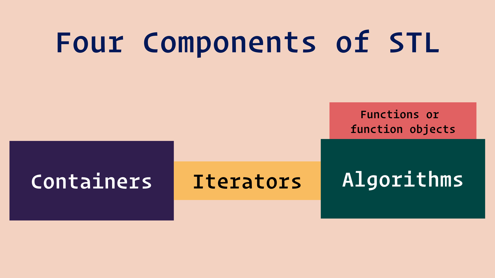

## Introduction

The power of the Standard Template Library is that it provides generic containers and generic algorithms in such a way that most of the algorithms work on most of the containers, no matter what type of data the containers store. Performance is a very important aspect of the Standard Library. The goal is to make the Standard Library containers and algorithms as fast as, or faster than hand-written code

:::note
The use of any functionality provided by C headers is discouraged in favor of true C++ functionality
:::

The Standard Library makes heavy use of the C++ features called templates and operator overloading. A C++ programmer who wishes to claim language expertise is expected to be familiar with the Standard Library. You can save yourself immeasurable time and energy by incorporating Standard Library containers and algorithms into your programs instead of writing and debugging your own versions. Now is the time to master this Standard Library.

STL has Four components

### Containers

Containers are the heart of the STL. The library defines four categories of containers, each for a different purpose:

1. sequence containers
2. associate containers
3. container adapters
4. pseudo-containers.

Each container category has been defined for a group of applications. Each container in each category is used for a specific purpose.

### Algorithms

Algorithms are operations that we apply to the container elements. They are divided into four categories:

1. **non-mutating algorithms :** which do not change the container structure
2. **mutating algorithms :** which change the structure
3. **sorting algorithms :** which reorder elements in a container
4. **numeric algorithms :** which apply mathematical operations to the elements.

### Iterators

An iterator allows us to access each element individually and apply the desired operation to it. This means that we do not need one algorithm that counts one type and another that counts another type. An algorithm can be applied to any container that provides the type of iterators that the container supports.

### Functions and Function Objects

To apply algorithms to the container, STL uses functions or function objects in the algorithm definition. They allow the STL to define a generic algorithm and use functions or function objects to make the algorithm specific. In the first case, we need a function definition; in the second case, we need a class for which the operator() is defined. The user defines a function for the first case, but the class is normally defined in the STL library and the user can only call the constructor of the class.
