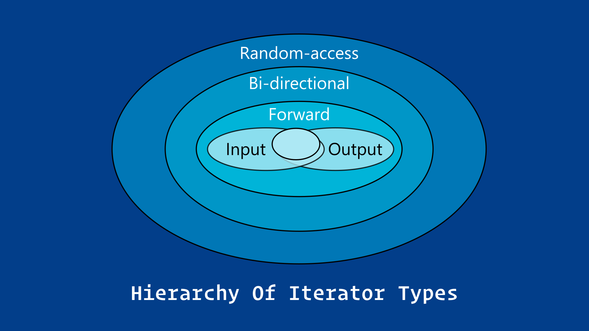
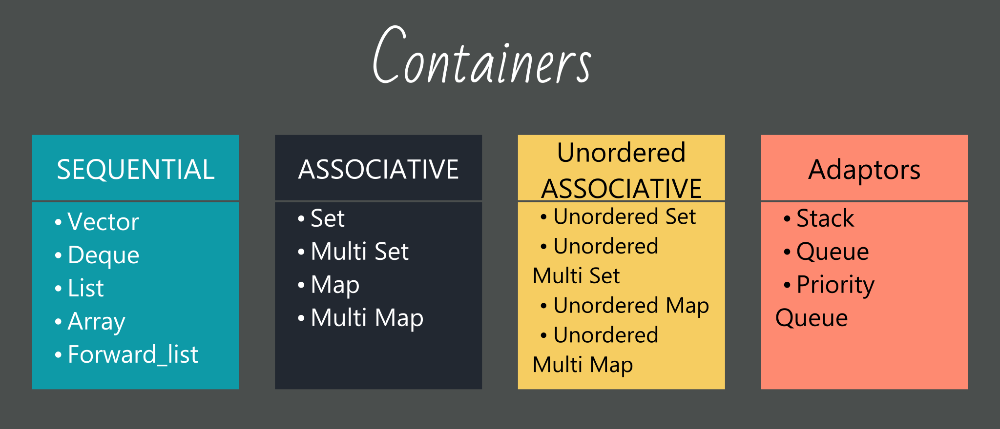

## Introduction

The power of the Standard Template Library is that it provides generic containers and generic algorithms in such a way that most of the algorithms work on most of the containers, no matter what type of data the containers store. Performance is a very important aspect of the Standard Library. The goal is to make the Standard Library containers and algorithms as fast as, or faster than hand-written code

:::note
The use of any functionality provided by C headers is discouraged in favor of true C++ functionality
:::

The Standard Library makes heavy use of the C++ features called templates and operator overloading. A C++ programmer who wishes to claim language expertise is expected to be familiar with the Standard Library. You can save yourself immeasurable time and energy by incorporating Standard Library containers and algorithms into your programs instead of writing and debugging your own versions. Now is the time to master this Standard Library.

STL has Four components

### Containers

Containers are the heart of the STL. The library defines four categories of containers, each for a different purpose:

1. sequence containers
2. associate containers
3. container adapters
4. pseudo-containers.

Each container category has been defined for a group of applications. Each container in each category is used for a specific purpose.

### Algorithms

Algorithms are operations that we apply to the container elements. They are divided into four categories:

1. **non-mutating algorithms :** which do not change the container structure
2. **mutating algorithms :** which change the structure
3. **sorting algorithms :** which reorder elements in a container
4. **numeric algorithms :** which apply mathematical operations to the elements.

### Iterators

An iterator allows us to access each element individually and apply the desired operation to it. This means that we do not need one algorithm that counts one type and another that counts another type. An algorithm can be applied to any container that provides the type of iterators that the container supports.

### Functions and Function Objects

To apply algorithms to the container, STL uses functions or function objects in the algorithm definition. They allow the STL to define a generic algorithm and use functions or function objects to make the algorithm specific. In the first case, we need a function definition; in the second case, we need a class for which the operator() is defined. The user defines a function for the first case, but the class is normally defined in the STL library and the user can only call the constructor of the class.

## Iterators

An iterator is an abstraction of a pointer. It is a class type that has a pointer as a data member and predefined operations that can be applied to the pointer member. We can instantiate an object of an iterator and then apply the operations defined for it.

One benefit of an iterator over a pointer is that we cannot limit the operations defined for a pointer, nor can we augment the operations defined for a pointer. But we can do both for an iterator.

Another advantage of an iterator is that it can hide the internal structure of a container. Each container can define its own iterator type whose design is hidden from the user, but the user can create an iterator of that type and access the objects in the container. The way iterators work with most containers is that the STL defines several internal iterators that are fixed and cannot move.

We can categorize iterators into five types

1. input iterator
2. output iterator
3. forward iterator
4. bidirectional iterator
5. random-access iterator

:::tip
Only the sequential containers, ordered associative containers, and unordered associative containers provide iterators. The container adaptors and bitset class do not support iteration over their elements.
:::

| Container      | Type Of Iterator Supported    |
| -------------- | ----------------------------- |
| Vector         | Random-access                 |
| Deque          | Random-access                 |
| List           | Bidirectional                 |
| Map            | Bidirectional                 |
| MultiMap       | Bidirectional                 |
| Set            | Bidirectional                 |
| MultiSet       | Bidirectional                 |
| Stack          | &cross; No Iterator Supported |
| Queue          | &cross; No Iterator Supported |
| Priority-Queue | &cross; No Iterator Supported |

### Input Iterator

An input iterator can use the dereference operator only to read from a container; it is not allowed to write to it. In other words, an input iterator treats the container as a source of data items to read.

### Output Iterator

An output iterator can use the dereference operator to only write to a container; it is not allowed to read from it.

### Forward Iterator

A forward iterator can read or write elements. Its functionality is the combination of the input and output iterators.

### Bidirectional Iterator

A bidirectional iterator can move in both directions: backward and forward. The `++` and `−−` operators are defined for this iterator.

### Random-Access Iterator

A random-access iterator has the capabilities of a bidirectional iterator, and in addition it supports the add (`+`) operator and the subtract operator (`−`). It also provides four relational operators (`<`, `<=`, `>`, and `>=`) that are not provided by the other iterators. These operators allow us to use the index operator [ ], which requires the +, −, and relational operators for forward or backward movement.

#### Cheetsheet

| Iterator      |  read   |  write  |   `*`   |  `++`   |  `−-`   | `==`, `!=` | `<`, `<=`, `>`, `>=` | `+`, `−` |
| ------------- | :-----: | :-----: | :-----: | :-----: | :-----: | :--------: | :------------------: | :------: |
| input         | &check; |         | &check; | &check; |         |  &check;   |                      |          |
| output        |         | &check; | &check; | &check; |         |  &check;   |                      |          |
| forward       | &check; | &check; | &check; | &check; |         |  &check;   |                      |          |
| bidirectional | &check; | &check; | &check; | &check; | &check; |  &check;   |                      |
| random-access | &check; | &check; | &check; | &check; | &check; |  &check;   |       &check;        | &check;  |

### Constantness

A container can also define two types of iterators

#### Type: const iterator

The type `const iterator` defines an iterator type that is a constant object. In other words, it cannot be changed after it is created. We cannot move the const iterator to point to another element. It is like the name of an array that is a constant pointer.

#### Type: const_iterator

The type `const_iterator` defines an iterator type in which the dereferenced item is an `rvalue` (cannot be changed by the iterator). This is similar to when we declare an array whose elements are constants.

:::info
`const_iterators` and `const_reverse_iterators` provide read-only access to elements of the container.
:::

## Containers

:::note
The C++ Standard Library containers are homogeneous: they allow elements of only one type in each container.
:::

- [Containers REFERENCE 1](https://en.cppreference.com/w/cpp/container)
- [Containers REFERENCE 2](https://www.cplusplus.com/reference/stl/)

## Sequence Containers

Sequence containers are ordered collections in which every element has a certain position. This position depends on the time and place of the insertion, but it is independent of the value of the element.

### General public interface of Sequence Containers

The abbreviation SC must be replaced with one of the three sequence containers (vector, deque, or list) when the corresponding column is ticked. Each of these containers is a template class in which T defines the type of the element in the container. The typename T can be any built-in or user-defined type. We have used iter for an iterator, inIter for an input iterator, and pred for a Boolean function returning true or false.

| Constructors, assignment, and destructor             | Vector  |  Deque  |  List   |
| ---------------------------------------------------- | :-----: | :-----: | :-----: |
| `SC <T> :: SC()`                                     | &check; | &check; | &check; |
| `SC <T> :: SC(size\*type n, const T& value = T())`   | &check; | &check; | &check; |
| `SC <T> :: SC(const_iter first, const_iter last)`    | &check; | &check; | &check; |
| `SC <T> :: SC(const SC <T>& other)`                  | &check; | &check; | &check; |
| `SC <T>& SC <T> :: operator =(const SC <T> & other)` | &check; | &check; | &check; |
| `SC <T> :: ~SC()`                                    | &check; | &check; | &check; |

| Size and capacity                                    | Vector | Deque | List |
| ---------------------------------------------------- | :----: | :---: | :--: |
| `size_type SC <T> :: size()`                         |   ✓    |   ✓   |  ✓   |
| `size_type SC <T> :: max_size()`                     |   ✓    |   ✓   |  ✓   |
| `void SC <T> :: resize(size_type n, T value = T() )` |   ✓    |   ✓   |  ✓   |
| `bool SC <T> :: empty()`                             |   ✓    |   ✓   |  ✓   |
| `size_type SC <T> :: capacity()`                     |   ✓    |       |      |
| `void SC <T> :: reserve(size_type, n)`               |   ✓    |       |      |

| Accessing elements (constant and nonconstant versions) | Vector | Deque | List |
| ------------------------------------------------------ | :----: | :---: | :--: |
| `T& SC <T> :: front()`                                 |   ✓    |   ✓   |  ✓   |
| `T& SC <T> :: back()`                                  |   ✓    |   ✓   |  ✓   |
| `T& SC <T> :: operator(size_type index)`          |   ✓    |   ✓   |      |
| `T& SC <T> :: at(size_type index)`                     |   ✓    |   ✓   |      |

| Iterators (regular and constant\* iterator versions) | Vector | Deque | List |
| ---------------------------------------------------- | :----: | :---: | :--: |
| `iter SC <T> :: begin()`                             |   ✓    |   ✓   |  ✓   |
| `iter SC <T> :: end()`                               |   ✓    |   ✓   |  ✓   |
| `reverse_iter SC <T> :: rbegin()`                    |   ✓    |   ✓   |  ✓   |
| `reverse_iter SC <T> :: rend()`                      |   ✓    |   ✓   |  ✓   |

| Insertion                                                      | Vector | Deque | List |
| -------------------------------------------------------------- | :----: | :---: | :--: |
| `void SC <T> :: push_front(const T& value)`                    |        |   ✓   |  ✓   |
| `void SC <T> :: push_back(const T& value)`                     |   ✓    |   ✓   |  ✓   |
| `iter SC <T> :: insert(iter pos, const T& value)`              |   ✓    |   ✓   |  ✓   |
| `void SC <T> :: insert(iter pos, size_type n, const T& value)` |   ✓    |   ✓   |  ✓   |
| `void SC <T> :: insert(iter pos, InIter first, inIter last)`   |   ✓    |   ✓   |  ✓   |

| Erasure                                         | Vector | Deque | List |
| ----------------------------------------------- | :----: | :---: | :--: |
| `void SC <T> :: pop_front()`                    |        |   ✓   |  ✓   |
| `void SC <T> :: pop_back()`                     |   ✓    |   ✓   |  ✓   |
| `iter SC <T> :: erase(iter pos)`                |   ✓    |   ✓   |  ✓   |
| `iter SC <T> :: erase(iter first, iter second)` |   ✓    |   ✓   |  ✓   |
| `void SC <T> :: clear()`                        |   ✓    |   ✓   |  ✓   |
| `void SC <T> :: remove(const T& value)`         |        |       |  ✓   |
| `void SC <T> :: remove_if(pred p)`              |        |       |  ✓   |
| `void SC <T> :: unique(pred p)`                 |        |       |  ✓   |

| Splice, merge, and sort                                      | Vector | Deque | List |
| ------------------------------------------------------------ | :----: | :---: | :--: |
| `void SC <T>::splice(iter pos, SC<T> other)`                 |        |       |  ✓   |
| `void SC <T>::splice(iter pos, SC<T> other, iter other)`     |        |       |  ✓   |
| `void SC <T>::splice(iter pos, SC<T> other, iter i, iter j)` |        |       |  ✓   |
| `void SC <T>:: merge(SC<T> other)`                           |        |       |  ✓   |
| `void SC <T> :: sort()`                                      |        |       |  ✓   |

| Swapping                            | Vector | Deque | List |
| ----------------------------------- | :----: | :---: | :--: |
| `void SC <T> :: swap(SC<T>& other)` |   ✓    |   ✓   |  ✓   |

| Global functions (op means <, <=, >, >=, == or !=)      | Vector | Deque | List |
| ------------------------------------------------------- | :----: | :---: | :--: |
| `bool operator op(const SC<T> left, const SC<T> right)` |   ✓    |   ✓   |  ✓   |
| `void swap(SC<T>& left, SC<T>& right)`                  |   ✓    |   ✓   |  ✓   |
